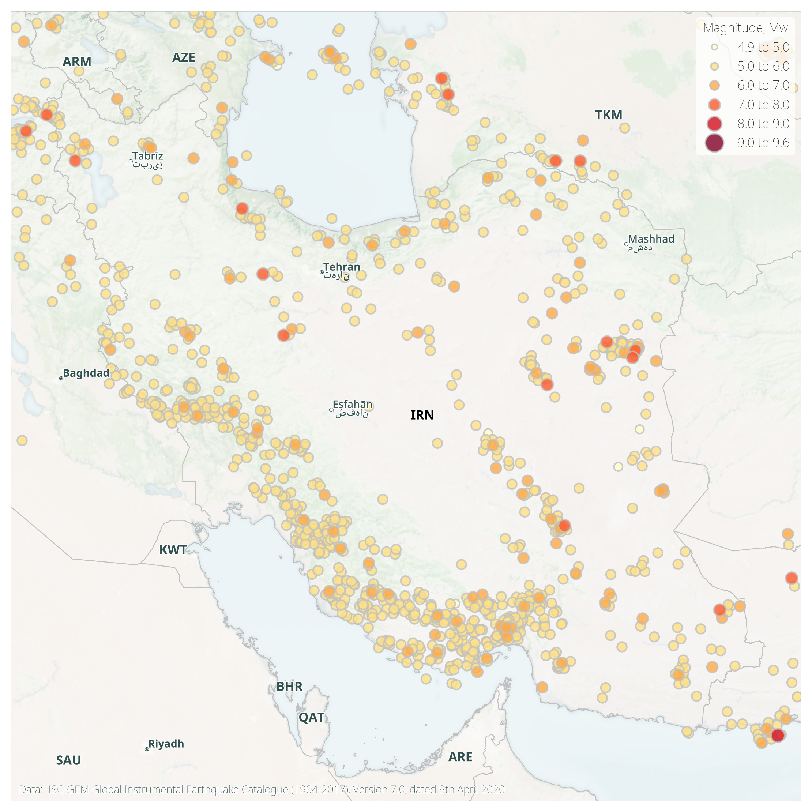
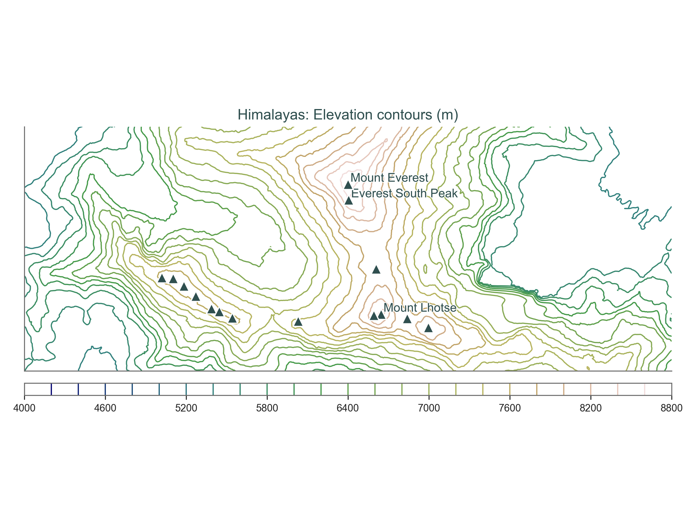
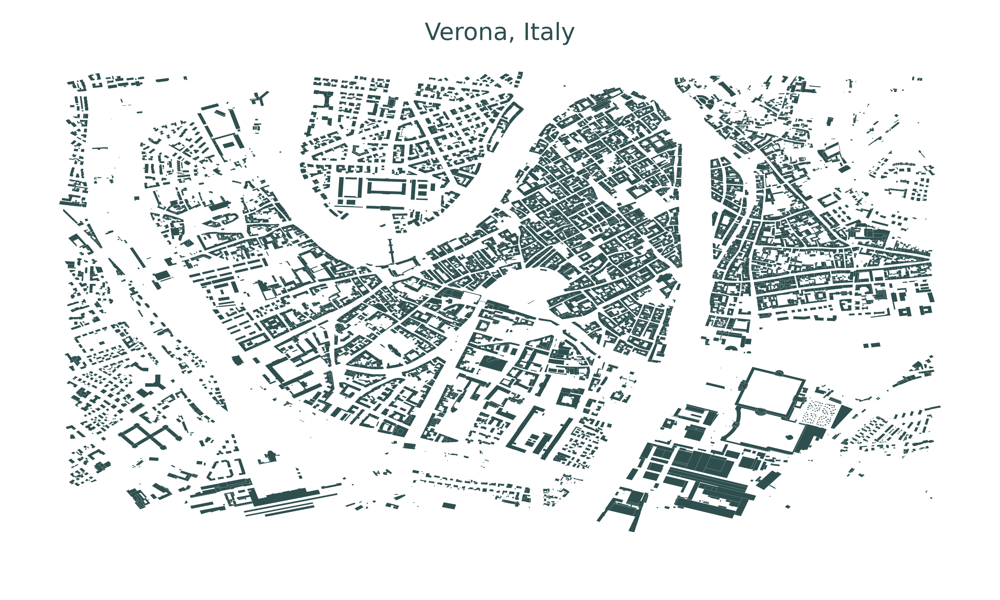
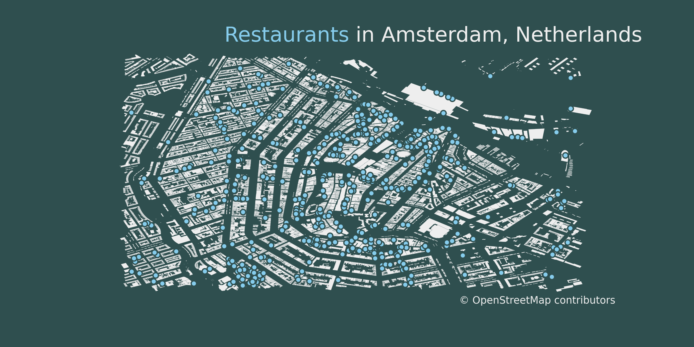
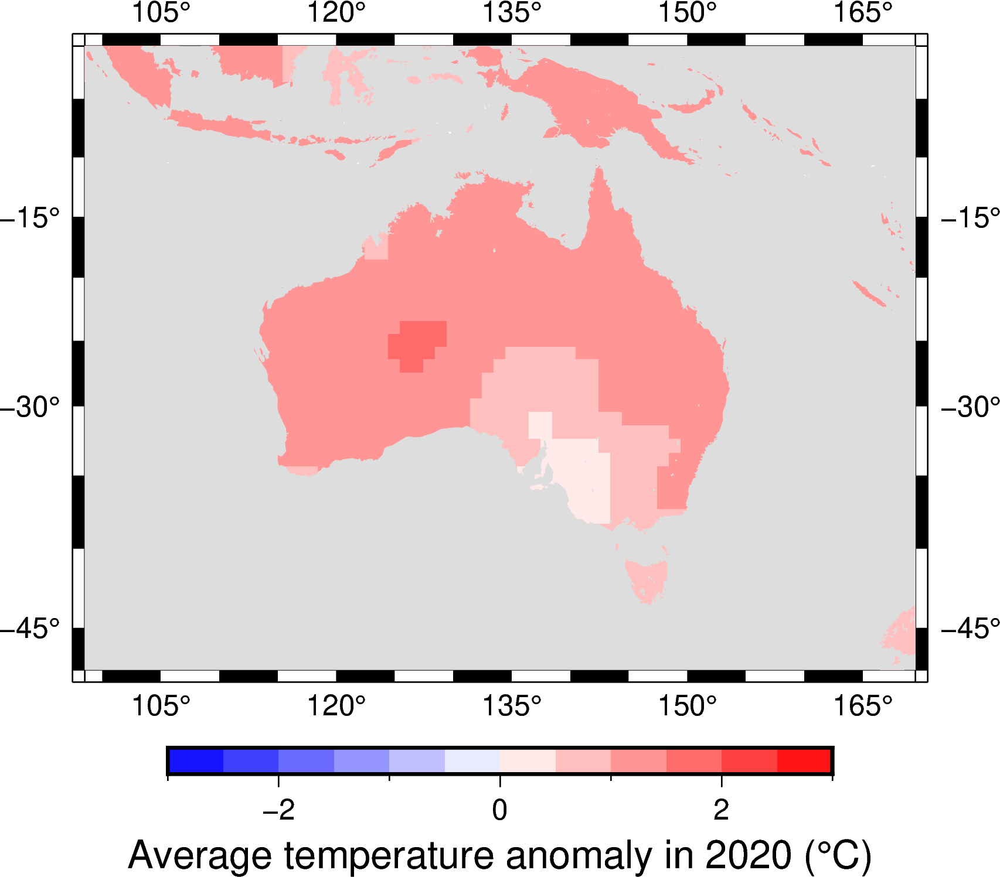
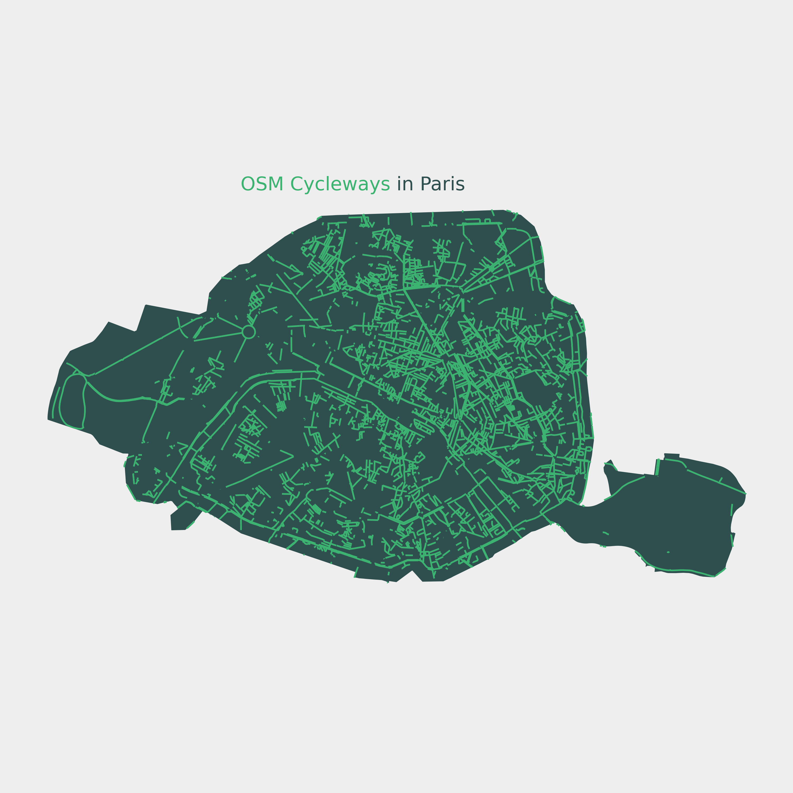
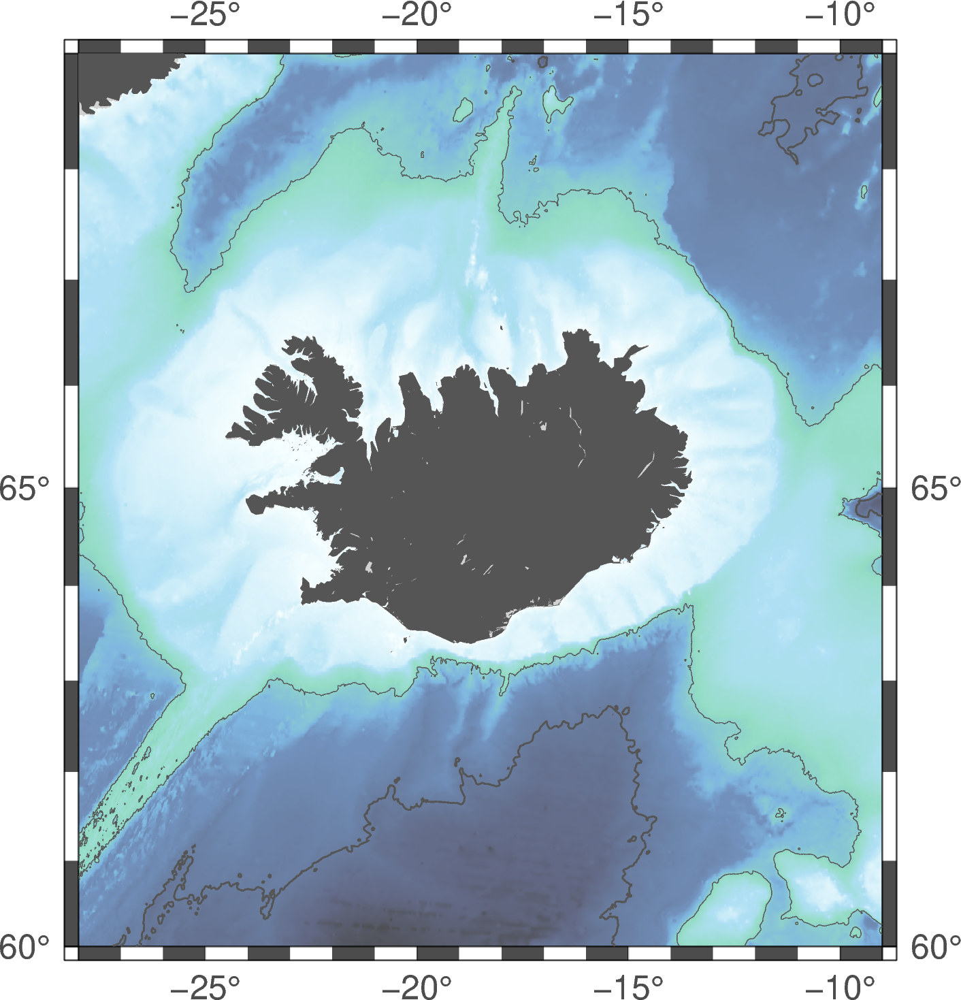
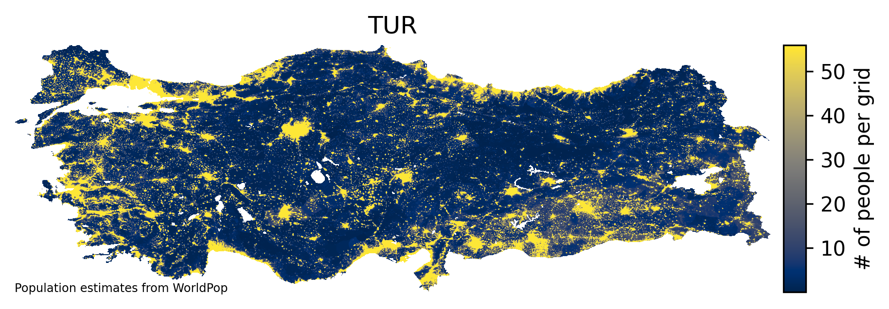
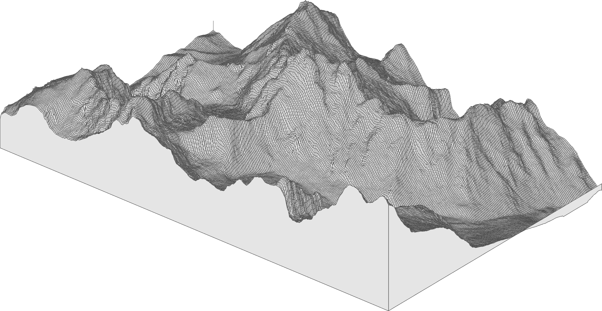

# 🌍 30 Day Map Challenge 2021

This repository hosts my code and contributions to the 2021 #30DayMapChallenge. My goal is to primarily use Python for each submission, and (where possible) to include datasets relevant to my daily work as a disaster risk analyst.

> The [#30DayMapChallenge](https://github.com/tjukanovt/30DayMapChallenge) was started by Topi Tjukanov

 

---

## 📊 Contributions

| Category             |  Example |
:-------------------------:|:-------------------------:
[Day 1: Points](notebooks/01_Points.ipynb)  |  
[Day 2: Lines](notebooks/02_Lines.ipynb)  |  
[Day 3: Polygons](notebooks/03_Polygons.ipynb)  |  
[Day 4: Hexagons]()  |  Coming soon!
[Day 5: OpenStreetMap](notebooks/05_OSM.ipynb)  |  
[Day 6: Red](notebooks/06_Red.ipynb)  |  
[Day 7: Green](notebooks/07_Green.ipynb)  |  
[Day 8: Blue](notebooks/08_Blue.ipynb)  |  
[Day 9: Monochrome](notebooks/09_Monochrome.ipynb)  |  
[Day 10: Raster](notebooks/10_Raster.ipynb)  |  
[Day 11: 3D](notebooks/11_3D.ipynb)  |  
